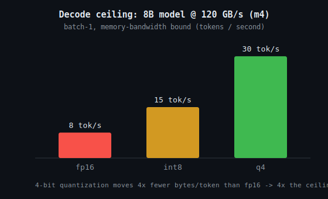

<h1 align="center">HIGH-PERFORMANCE LLM SYSTEMS</h1>

<p align="center"><b>Benchmarking and optimizing Llama-3 inference on Apple M4 silicon — a roofline performance model plus a runnable measurement harness.</b></p>

<p align="center">
  
  
  
  
</p>

<p align="center">Author: <b>Avinash Kollu</b> · GitHub: <a href="https://github.com/avinashkollu-git">@avinashkollu-git</a></p>

---

## Overview

Single-batch LLM **decode** (generating one token at a time) is a *memory-bandwidth*
problem, not a compute problem: to emit each new token the hardware must stream the
entire weight set out of unified memory once. So before touching a profiler, you can
predict the ceiling:

```
max tokens/sec  =  memory_bandwidth (bytes/s)  /  model_weight_bytes
```

This project makes that concrete for Apple's M4 family: a dependency-free **roofline
model** computes the theoretical ceiling, and a **benchmark harness** measures what
MLX actually achieves — so the gap between them is your optimization headroom.

## Why this matters (and how it ties to silicon)

The same reasoning a silicon engineer uses — arithmetic intensity, the memory wall,
roofline analysis, quantization to cut bytes-per-weight — is exactly what governs
LLM inference on a real chip. This repo is that analysis applied end to end.

## Repository layout

```
High-Performance-LLM-Systems/
├── bench/
│   ├── roofline.py         # theoretical decode ceiling (pure stdlib, runs anywhere)
│   ├── benchmark_mlx.py    # measure TTFT / decode tok-s / peak memory with MLX
│   └── plot_results.py     # chart measured throughput vs the roofline ceiling
├── results/                # your generated CSV + plot land here (kept empty in repo)
├── requirements.txt        # mlx, mlx-lm, matplotlib
├── Makefile                # make roofline | bench | plot
└── LICENSE                 # MIT
```

## The roofline model

Runs with **no dependencies** — try it immediately:

```bash
python3 bench/roofline.py --params 8 --chip m4
```

```text
Roofline: batch-1 DECODE ceiling for a 8B-param model
Memory bandwidth: 120 GB/s  (m4)

  quant     weights   max tok/s    ms/token
  ------  ---------  ----------   ---------
  fp16      16.00GB         7.5      133.33
  int8       8.00GB        15.0       66.67
  q4         4.00GB        30.0       33.33
```



These are **upper bounds** (100 % bandwidth, zero overhead). Real throughput sits
below them; how far below tells you how efficient the runtime is. It also shows why
4-bit quantization is the single biggest lever on a bandwidth-bound workload — it
cuts the bytes moved per token by 4× versus fp16.

### Apple M4 memory bandwidth (per Apple's published specs)

| Chip     | Unified-memory bandwidth |
|----------|--------------------------|
| M4       | 120 GB/s                 |
| M4 Pro   | 273 GB/s                 |
| M4 Max   | 410 GB/s (up to ~546 on the higher bin) |

Pass `--bandwidth <GB/s>` to model any chip; verify the figure for your exact unit.

## Measuring the real thing

```bash
pip install -r requirements.txt
python bench/benchmark_mlx.py --model mlx-community/Meta-Llama-3-8B-Instruct-4bit
python bench/plot_results.py                 # measured vs roofline chart
```

The harness reports, as medians over several runs:

- **TTFT** — time to first token (prefill latency)
- **decode** — steady-state tokens/second
- **peak memory** — peak unified-memory footprint

`results/` is intentionally shipped empty so every number there is measured on your
own machine, never second-hand.

## Skills demonstrated

Performance modelling (roofline / arithmetic intensity), the memory wall and why
decode is bandwidth-bound, quantization trade-offs, Apple-Silicon / MLX inference,
and honest, reproducible benchmarking.

## License

MIT — see [LICENSE](LICENSE).
